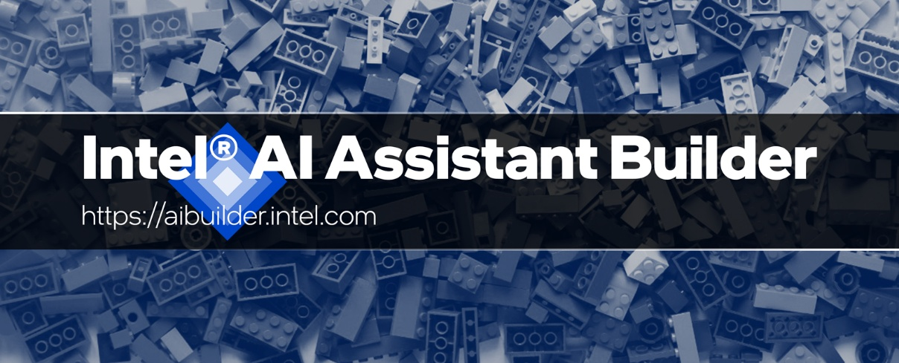
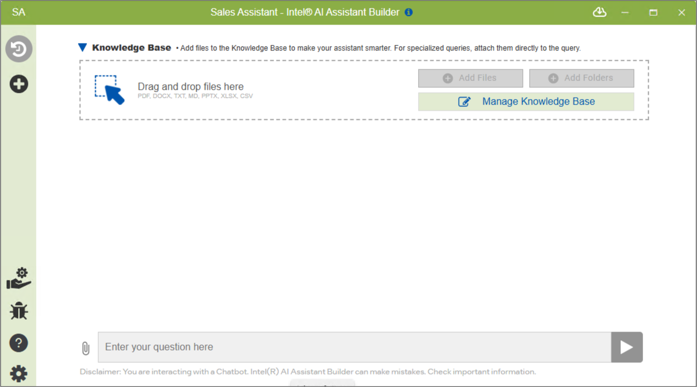
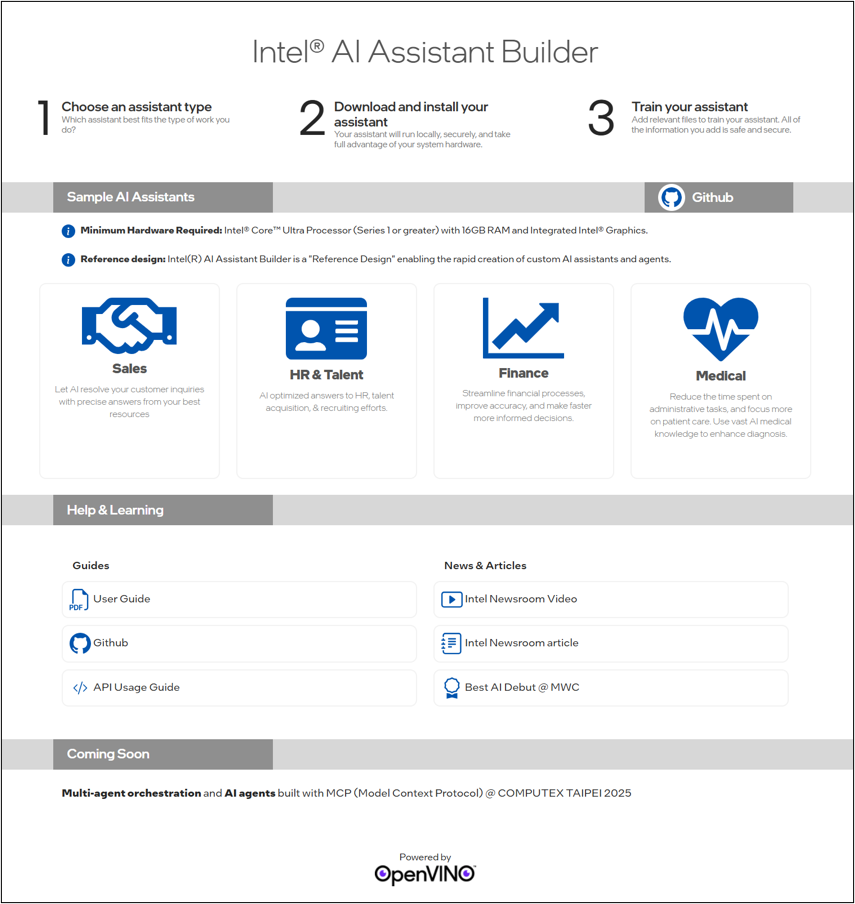
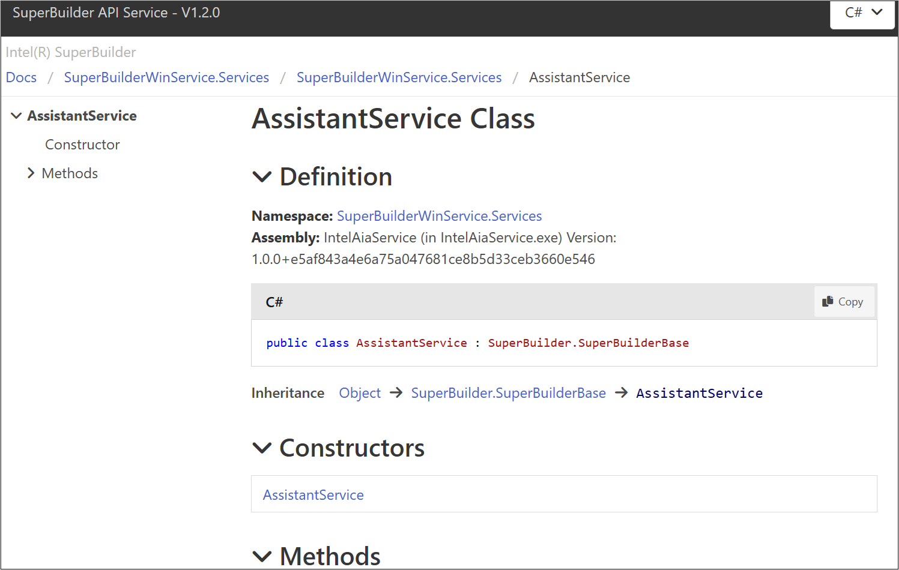
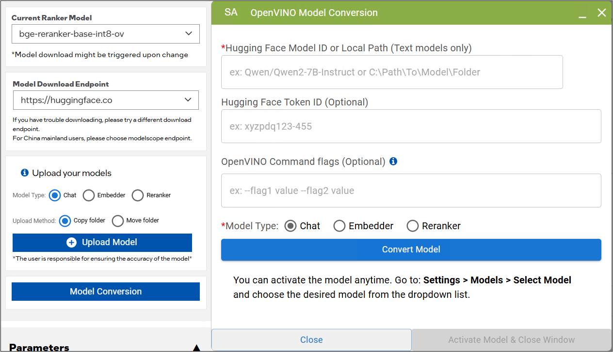

[](https://aibuilder.intel.com)

<h1 align="center">Intel® AI Assistant Builder <br> SuperBuilder <br></h1>

<p align="justify"><strong>Intel® AI Assistant Builder</strong>—also known as <strong>SuperBuilder</strong>—is Intel’s Gen-AI reference design platform that enables the rapid creation of custom AI assistants and agents tailored to specific industry needs and proprietary data.
These assistants streamline everyday tasks and deliver intelligent solutions by leveraging your internal knowledge bases—<strong>all while running entirely locally</strong> on Intel®-based AI PCs. Your data and workflows remain private and secure, powered by cutting-edge large language models (LLMs), customizable agentic workflows, and performance-optimized processing.</p>

- [Key Benefits](#key-benefits)
- [Prerequisites](#prerequisites)
  - [Hardware requirements](#hardware-requirements)
  - [Software requirements](#software-requirements)
- [Getting started](#getting-started)
- [What's included](#whats-included)
  - [Sample code](#sample-code)
  - [SuperBuilder Service API Guide](#superbuilder-service-api-guide)
- [LLM Model List](#llm-model-list)
- [Features](#features)
- [Tips, Troubleshooting, Known Issues](#tips-troubleshooting-known-issues)
- [Release Notes](#release-notes)
  - [Version 1.2](#version-12)
  - [Previous Release Notes](#previous-release-notes)
    - [Version 1.1](#version-11)
    - [Version 1.0](#version-10)
- [Contact](#contact)


<br>

### Key Benefits
***
- **Simple & Accelerated Development**: Jumpstart your AI assistant with a rich set of prebuilt **APIs**, reusable **templates**, and a user-friendly tooling environment designed for fast prototyping and deployment.
- **Flexible & Modular Architecture**: Use our turnkey front-end reference design for immediate rollout or integrate only the backend components you need to build a fully customized experience.
- **Secure & Local Execution**: Keep your proprietary data and IP safe with AI that runs directly on-device—no cloud required.
- **Customizable for Any Industry**: Tailor assistants to meet the demands of your specific domain, whether in healthcare, finance, manufacturing, or beyond.
- **Scalable & Portable**: Package and deploy across a wide range of devices and use cases with ease.

<br>
<p align="justify">With Intel® AI Assistant Builder, you can empower your teams and customers with intelligent, adaptable, and secure AI solutions—delivered simply and on your terms.</p>




<br>

### Prerequisites
***
<p align="justify">The download, installation, and initial setup of the application require an internet connection. Once the initial setup is complete, no connection is needed unless you choose to change the model used by the assistant, in which case additional file downloads may be required.</p>

#### Hardware requirements
  | **Component** | **Minimum Requirements**                                     | **Recommended Requirements**                |
  |---------------|--------------------------------------------------------------|---------------------------------------------|
  | Processor     | Intel® Core™ Ultra processor Series 1 (Meteor Lake)          | Intel® Core™ Ultra 200V series (Lunar Lake) |
  | Memory (RAM)  | 16GB                                                         | 32GB                                        |
  | Storage       | 4GB for AI Assistant with 1 LLM                              | 12GB for AI Assistant with 3 LLMs           |
  | Graphics      | Integrated Intel® Graphics                                   | Integrated Intel® Arc™ Graphics             |
  | Network       | Broadband connection for LLMs and other components’ download |                                             |
> [!NOTE]
>  * Intel® AI Assistant Builder has been validated on limited Intel AIPC: MTL, LNL, and ARL systems.
> * Minimum Intel Graphics driver version is **30.0.100.9955**. and minimum NPU driver version is **32.0.100.3714**. 

#### Software requirements
  Intel® AI Assistant Builder has been validated for use on **Microsoft Windows 11 version 23H2 or newer**. During the installation process, Intel® AI Assistant Builder application may download and install required components.

> [!TIP]
> To update your Intel® GPU and NPU drivers, please visit [Intel®: Download Drivers & Software](https://www.intel.com/content/www/us/en/download-center/home.html).

### Getting started 
***
> [!WARNING]
> Currently, Intel® AI Assistant Builder only supports **one Assistant installation at a time** on your AI PC. Users are advised to fully remove the existing Assistant before installing other ones.
- #### Download the software
1. Open your web browser and go to [https://aibuilder.intel.com](https://aibuilder.intel.com/)
2. Click on one of the available AI Assistants to start the download. For general use, we recommend the “Sales Assistant”. The assistant’s capability (and appearance) can be customized after installation.
3. Locate and open the downloaded installer. The wizard will guide you through the required steps to successfully complete the installation.



- #### Using SuperBuilder
  - [Getting started](basic_usage.md)
  - [Special Query Functions](special_query.md)

> [!TIP]
> Please refer to the [user guide](https://aibuilder.intel.com/Intel%20AI%20Assistant%20Builder%20User%20Guide.pdf) for more details. 

<br>

### What's included
***
#### Sample code
  This folder contains a sample application created using SuperBuilder API service. We included sample projects build from `dotnet` , `Python` and `Go`. 

  [Sample Code](example/README.md)

#### [SuperBuilder Service API Guide](https://intel.github.io/intel-ai-assistant-builder/)
  This folder contains API service documentation. SuperBuilder API service's main entry point is the [AssistantService](https://intel.github.io/intel-ai-assistant-builder/html/127056c5-b74d-e4f7-a324-5e4aa7c09935.htm) class. You can also access the API document from this link: [API Documentation](https://intel.github.io/intel-ai-assistant-builder/)
  
   
 
<br>

### LLM Model List
***
<p align="justify">Intel® AI Assistant Builder supports most of LLM models that enabled by <strong>Intel® OpenVINO</strong>. The application implements model recommendation based on the assistant type and system hardware, using the performance and accurancy data we collected inside our lab.</p> 

Currently in `v1.2.0`, we provide the following models in our application selection:

- **Chat Models**
  ```
  * Phi-4-mini-instruct-int4-ov
  * Qwen2.5-7B-Instruct-int4-ov
  * DeepSeek-R1-Distill-Qwen-7B-int4-ov
  * BioMistral-7B-SLERP-int4
  * Qwen2-7B-Instruct-int4-ov
  * Phi-3-mini-128k-instruct-int4-ov
  * Phi-3-mini-4k-instruct-int4-ov
  * neural-chat-7b-v3-3-int4-ov
  * notus-7b-v1-int4-ov
  * zephyr-7b-beta-int4-ov
  ```

- **Vision Models**
  ```  
  * Phi-3.5-vision-instruct-int4-ov
  ```
  
- **RAG Models**
  ``` 
  * bge-base-en-v1.5-int8-ov
  * bge-reranker-base-int8-ov
  ``` 

- **NPU Models**
  ``` 
  * phi-3-mini-2k-int4_sym_g128-npu
  ``` 

Our application also allows you to **upload your own model** or **convert models from Hugging Face directly** from our UI. Check out the detailed model features.

 

<br>

### Features
*** 
 * **Local LLM and RAG chat**: Build a local knowledge base with a variety of file formats.
 * **Configurable Parameters and Settings**: Provide a rich sets of parameters for configuring LLM and RAG models, ingestion, retrieval, and reranking processes, and controlling application operations.
 * **Special Query Functions**: Enable users to perform domain specific activities, such as querying Excel files and images.
 * **Agentic Workflow Example**: Include a built-in agentic workflow example for Resume Match.
 * **Model Management**: Facilitate model switching, uploading, and conversion.
 * **UI customization**: Easily build a customized application interface. 
 * **Profile Management**: Import and export Assistant profile for backup, profile switching, and sharing.
 * **Localization Support**: Partial localization is available for Simplified Chinese (zh-Hans) and Traditional Chinese (zh-Hant). 
 * **Admin Mode**: An AI assistant builder with full access to settings can configure, preview, and evaluate the end-user experience using a simple chatbot interface.
 * **API Services**: Expose all features through SuperBuilder API services.
   
<br>

:bulb:**Upcoming Features** :sparkles: 
***

* **Multi-Agent Orchestration Framework**: Implement AI agents built with MCP (Model Context Protocol) for enhanced coordination.
* **E2E Enterprise Solution**: Facilitate Intel AIPC connection to edge/server clusters for comprehensive enterprise integration.
* **SuperBuilder API Service Only Installation Package**: Offer a streamlined API package that allows users to easily create custom UIs and seamlessly integrate SuperBuilder capabilities.
* **SST and TTS multimodality Features**: Provide advanced speech synthesis and text-to-speech functionalities that enable dynamic user interaction and communication.

<br>

### Tips, Troubleshooting, Known Issues
***
> [!IMPORTANT]
>* **Installation Issues**: Some antivirus software such as McAfee Antivirus software is known to interfere with the installation process of Intel® AI Assistant Builder on Windows systems. If you encounter installation problems and have antivirus installed, please stop the real-time scanning feature and then reinstall Intel® AI Assistant Builder. Once the installation is done and the models are loaded, you can re-enable it. Users might experience performance impact when antivirus real-time scanning is running.

> [!WARNING]
>* **Model Download Errors**: This issue could be due to a few reasons: 
>    - **HTTP/HTTPS Proxy for Enterprise Environments**: If you are an enterprise user and your organization uses an HTTP or HTTPS proxy, you need to configure it on your AI PC to enable the Intel® AI Assistant Builder to download LLMs, RAG, and other necessary components. Please consult your organization’s IT department to determine which proxy server(s) are in use and how to configure them up on your device.
>    - **Model Download Endpoint**: Check your model download endpoint and consider selecting a different download server.
>      - **For users in the PRC**, ***Model Scope*** is recommended.
>      - **For users in other regions**, please choose the ***Hugging Face***.
>* **Export Config Issues**: For configurations involving a large set of documents, only a partial set of text chunks is currently exported. Support for exporting a full set is currently under development.
>* **NPU model limitation**: The NPU model is supported only on ***Lunar Lake*** system.

> [!CAUTION]
>* **Initial load time / Unresponsive**: When the AI assistant is started, the assistant service and models must be initialized before the assistant can be used. During this time, the chat text entry field will be disabled, and a status message at the bottom of the window will indicate what is happening. When the AI assistant is ready, the status bar at the bottom of the window will be removed and the chat text entry will be enabled. Please note that the actual waiting time varies.
> 
>* **Model Loading Errors**: If a “model loading error” occurs, please make sure to update the GPU and NPU drivers to the latest version. The NPU model requires NPU Driver **32.0.100.3714 at a minimum**.
>* **Backend Not Ready**: During the first-time Intel® AI Assistant Builder start-up, errors may occur due to backend not ready condition, especially if the application is running for the first time on a system with a slow network connection.
>* **Upgrade Errors**: If you are upgrading from ```v1.1.0``` to ```v1.2.0```, the installer might have issues removing all your selected local files. If you wish to remove everything, we recommend fully uninstalling the application using Window's built-in _Add or Remove Programs_, and then installing ```v1.2.0```.
>* **Model Conversion Error**: The model conversion tool of Intel® AI Assistant Builder only supports models compatible with the **Intel® OpenVINO** platform. Not all models are supported. <br> 
Some models on Hugging Face require user consent before they can be downloaded. Our application cannot proceed with the download until you consent to the Hugging Face model terms.
>* **Query Tabular Data Issue**: Query Tabular Data will fail to process XLSX files having `time` format. A fix for this will be included in the next release.
>* **Conversation History - Reset to Defaults Issue**: Although the `Reset to Defaults` button sets the `Conversation History` to 0, the conversation history is still utilized in the context. To resolve this issue, please manually adjust the value using the slider.
>* **Intermittent Qwen2 and Qwen2.5 Models Issue**: The Qwen2 and Qwen2.5 models have a known intermittent issue where they occasionally generate unwanted responses with exclamation marks. This behavior is not consistently reproducible, but retrying the query typically resolves the problem.
<br>
> [!TIP]
>* **Multiple Assistants Support**: Users can use our Import and Export functions to try out multiple assistant profiles on the same local AI PC. 

### Release Notes
***
#### Version 1.2

- New Models Support
Intel(R) AI Assistant Builder now officially supports Qwen2.5-7B, Phi4-mini, and Deepseek-R1-Distilled-Qwen-7B.

- ModelScope Download Endpoint Support 
Intel(R) AI Assistant Builder now supports direct model downloads from ModelScope.cn, improving accessibility and convenience.

- Localization Support
Partial localization is available for Simplified Chinese (zh-Hans) and Traditional Chinese (zh-Hant). Language settings are automatically adjusted based on your Windows system language, but users can also manually select their preferred language in the Intel(R) AI Assistant Builder settings.

- Admin Mode Feature Enable
Intel(R) AI Assistant Builder now offers both a simple chatbot interface for end users and an admin interface with comprehensive configuration options. This enables administrators to configure, preview, and evaluate the end-user experience.

#### Previous Release Notes

##### Version 1.1

- HF-Mirror for Users in PRC
The HF-Mirror provides users in the People's Republic of China with faster, more reliable access to models.

- Model Conversion to OpenVINO Format
The model conversion utility enables the conversion of most 'Text Generation' models to the OpenVINO format for immediate use in the assistant or wherever you plan to use a given model. You can convert models directly from Hugging Face or from a local folder. Optimized performance, compatibility, and efficiency of model execution are just a few benefits of this new utility. Please note that the model conversion utility does not work with all models, and it is important to verify the accuracy of any converted model.

- Import and Export Assistant
The new "Import and Export Assistant" feature simplifies the process of transferring data and configurations between computers and when conducting upgrades or re-installations. The option to export a "Built" assistant and allow another user to import it facilitates collaboration and sharing.

- New HR Special Query called Resume Match
The new HR assistant feature allows unlimited resume uploads in one session, intelligently scores resumes against job descriptions, extracts key details from top candidates using RAG, and facilitates continuous conversational analysis of documents.

- Update to Query Tabular Data
The Query Tabular Data feature now shows the SQL query used to generate the response, allowing users to verify, correct if necessary, and rerun the adjusted query.

- New Collect Metrics Parameter
The new Collect Metrics parameter, when enabled by the user, gathers performance metrics related to file ingestion and response generation, providing valuable insights.

##### Version 1.0

- User Interface
  - UX customization: Users can upload their own logo and customize additional app colors.
  - Users can upload their own LLM or RAG models. Instructions are provided to convert models to a compatible format. Intel does not guarantee that all models will work.

- AI Features
  - Query Summary: Users can attach up to three files (PDF, DOCX, TXT) and generate a summary of each file, allowing them to ask follow-up questions based on the summary.
  - Query Tabular Data: Users can attach one file (XLSX, CSV). The data must be in tabular format, with headers in the first row and data in subsequent rows. This feature generates a description of the tabular data in each worksheet.
  - Query Images: Users can attach up to three files (PNG, JPEG, JPG) and generate a description of each image. This requires a vision model such as Phi-3.5-vision-instruct-int4-ov.

- NPU Model
  - NPU model support for Phi3-4K now offers an improved token length of 2K.

- New Assistant
  - Added Finance Assistant.

### Contact
***
For technical questions and feature requests, please use GitHub [Issues](https://github.com/intel/intel-ai-assistant-builder/issues).

We would love to hear about your experience. Please contact us at [&#115;&#117;&#112;&#112;&#111;&#114;&#116;&#046;&#097;&#105;&#098;&#117;&#105;&#108;&#100;&#101;&#114;&#064;&#105;&#110;&#116;&#101;&#108;&#046;&#099;&#111;&#109;](mailto:support.aibuilder@intel.com).
