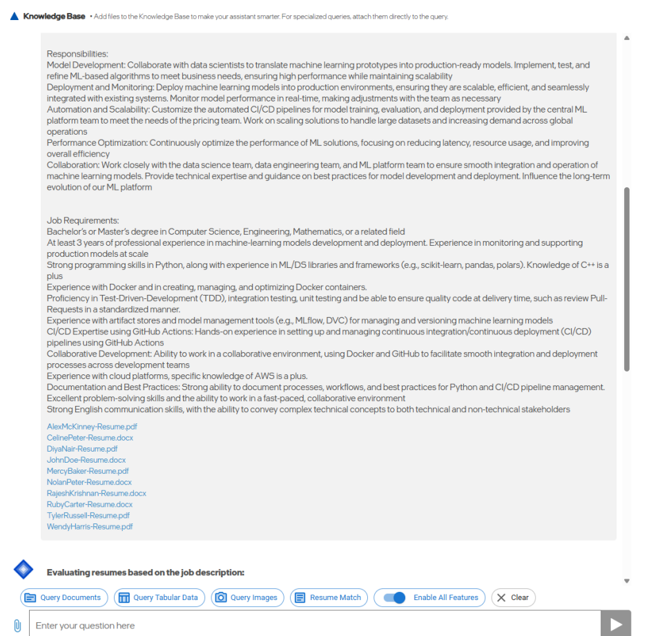

### Special Query Types

Special queries are used to “focus” the assistant on specific documents. This can yield better, more accurate results and help the assistant answer more sophisticated questions based on the context of the specified document(s). To use the special queries click the attach file icon (the paperclip icon next to the question entry field).

*\*PRO TIP:* Using small files which only contain information relevant to the topic at hand will yield the best results.

To close “Special query mode” click the “Clear” icon from the list of special queries. Starting a new chat session will also exit special query mode.

#### HR Resume Match

The resume match feature available in the "HR Assistant"; intelligently scores resumes against job descriptions, extracts key details from top candidates using RAG, and facilitates continuous conversational analysis of resume documents. To use the resume match feature:
1. Open the "Special Queries" list and choose "Resume Match". 

2. Attach the resume(s) of the candidates being considered for a given job (pdf, docx, txt)   
3. Provide the assistant with the job description you wish to measure the respective candidates against. This can be a short list of requirements or a detailed list of requirements similar to what might be found on a job board.
4. Start the evaluation. 
5. The assistant will rank the list of candidates and provide notes for the top four candidates, describing the reasons they were ranked highly. 

